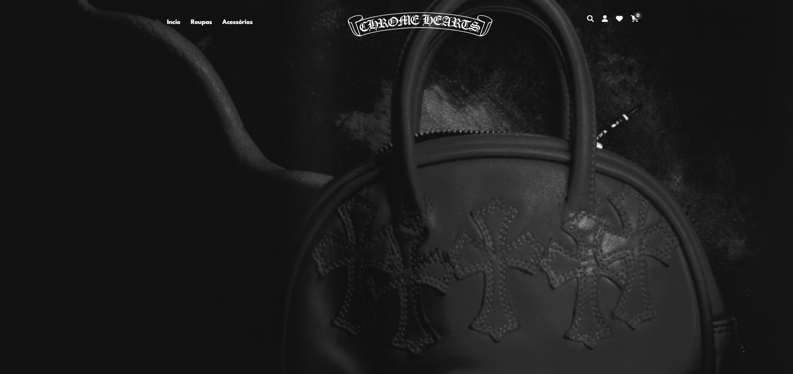

# ChromeHearts

## Visão Geral do Projeto

O site é um projeto desenvolvido para a disciplina de Desenvolvimento Web 2 da faculdade. Ele consiste em uma releitura do site da loja Chrome Hearts, com foco em oferecer uma interface moderna, estilizada e responsiva.

O objetivo principal deste trabalho é demonstrar habilidades em HTML, CSS e JavaScript, construindo um layout completo, funcional e visualmente atrativo.
Atualmente, o projeto é predominantemente visual, servindo como uma prova de conceito para design web e estruturação de páginas.

O site está hospedado em: chromeheart.netlify.app

---

## Funcionalidades

* **Página de Produtos:** Exibe diferentes itens inspirados na estética da Chrome Hearts, com imagens, preços e detalhes estilizados.
* **Design Inspirado na Marca:** Toda a identidade visual foi criada com base no estilo da Chrome Hearts, mantendo o tom minimalista da marca.
* **Página de Detalhes do Produto:** Simulação de uma página individual contendo imagem ampliada, descrição e visualização de detalhes do produto.
* * **Carrinho:** Estrutura criada com HTML + CSS + JS para simular a interação de adicionar itens ao carrinho.

---

## Visual do Projeto

A interface foi projetada para transmitir a estética premium da marca Chrome Hearts, utilizando tipografias marcantes, contrastes fortes e elementos que reforçam sua identidade.

---

## Tecnologias Utilizadas

* **HTML5:** Utilizado para a estrutura e conteúdo da página.
* **CSS3:** Empregado para estilização, layout e responsividade do site.
* * **JavaScript:** Utilizado para funções visuais e interações simples, como simulações de carrinho e manipulação do DOM.

---
